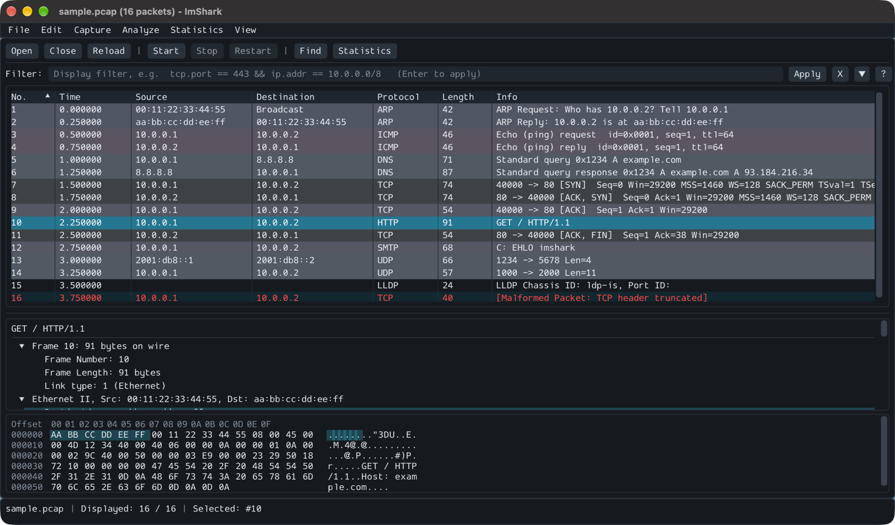
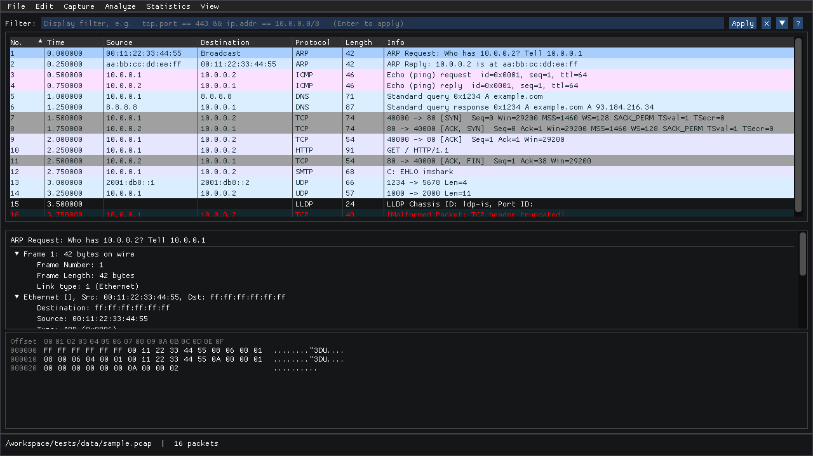

# ImShark

**English** | [Türkçe](README.tr.md)

[](https://github.com/Zaryob/imshark/actions/workflows/ci.yml)
[](https://github.com/Zaryob/imshark/actions/workflows/release.yml)
[](https://github.com/Zaryob/imshark/releases)
[](LICENSE)
[](CMakeLists.txt)


A Wireshark-inspired packet analyzer built with [Dear ImGui](https://github.com/ocornut/imgui). It opens capture files, dissects protocols and combines the packet list with an interactive protocol tree and a hex/ASCII view. Live capture through libpcap is supported as well.



*Native build on macOS (Apple Silicon); the image shows the synthetic `sample.pcap` from the repository.*

<details><summary>Linux (Docker, software OpenGL) — before the UI refresh</summary>



*The real application started in Ubuntu 24.04 Docker with Mesa software OpenGL. [Reproducible validation](docs/VALIDATION.md).*

</details>

## What it does

- **Capture files:** pcap and pcapng; gzip-compressed files; readers for Sun snoop, NetMon 2.x, Endace ERF and AIX iptrace 2.0.
- **Packet inspection:** sortable, colorized list, byte highlighting for the selected field, text/hex search and copy.
- **Display filters:** protocol and field queries, CIDR, sets and PCRE2 regular expressions evaluated under hard work limits; validation while typing and a field reference.
- **Streams and statistics:** TCP/UDP Follow Stream, TCP and IP reassembly, conversations, endpoints, protocol hierarchy and Expert Information.
- **TLS/DTLS:** decryption of supported TLS 1.2/1.3 and DTLS 1.2 cipher suites with a key log file or keys embedded in pcapng.
- **Export:** all, displayed or selected packets as pcap, pcapng, CSV and JSON; stream data as raw bytes.
- **Live capture:** interface selection, BPF filter, snaplen, promiscuous mode and start/stop/restart.
- **Interface:** dark and light themes, a welcome screen with recent files, a toolbar and resizable panes; the window size and position are remembered.

Detailed coverage for Ethernet, wireless, IP, DNS, HTTP, TLS, enterprise, database, USB and Bluetooth protocols is in the [support matrix](docs/SUPPORT_MATRIX.md). Recognizing a protocol does not mean every field is decoded; the [known issues](docs/KNOWN_ISSUES.md) list what is not.

## Download

Download the latest release from [GitHub Releases](https://github.com/Zaryob/imshark/releases/latest): an AppImage, DEB and tar.gz for Linux x86_64, a DMG for macOS Apple Silicon and a ZIP for Windows x86_64. Check your download against `SHA256SUMS.txt`. The release workflow publishes packages only when every platform check passes. The macOS app is ad hoc signed, without Developer ID signing or notarization (the first time, allow it under System Settings > Privacy & Security > Open Anyway); the Windows build has no live capture.

Versions follow SemVer in the `v0.x.y` series (`v0.8.x` → `v0.9.x` → `v0.10.x` ...); the release workflow is triggered by a `vMAJOR.MINOR.PATCH` tag. The `v0.9.0` tag produced no packages because of a Windows (MSVC) test build failure; `v0.9.1` stopped on Docker Hub outages in the Linux GUI check; [`v0.9.2`](https://github.com/Zaryob/imshark/releases/tag/v0.9.2) is the first published release. Remaining release checks are tracked in the [release backlog](https://github.com/Zaryob/imshark/issues/2); local test results are in the [portfolio validation record](docs/PORTFOLIO_VALIDATION.md).

## Quick start

Dear ImGui **[1.92.9b](https://github.com/ocornut/imgui/releases/tag/v1.92.9b)** and its GLFW/OpenGL3 backends are installed through vcpkg.

You need a C++20 compiler, CMake ≥ 3.21, Ninja, Git and a bootstrapped [vcpkg](https://github.com/microsoft/vcpkg), with `VCPKG_ROOT` pointing at it. The third-party C/C++ libraries of the default build come from the version-pinned vcpkg manifest; see the [build guide](docs/BUILDING.md) for platform prerequisites and the optional Npcap setup on Windows.

```sh
cmake --preset default
cmake --build --preset default
ctest --preset default
```

Open the sample capture:

```sh
# Linux
./build/imshark tests/data/sample.pcap

# macOS
./build/imshark.app/Contents/MacOS/imshark tests/data/sample.pcap

# Windows (PowerShell)
.\build\imshark.exe tests/data/sample.pcap
```

`imshark --help` lists the command-line options; `--version` works without a display server.

Use **File > Open** (Ctrl+O; Cmd+O on macOS) for the file picker, or drop a file on the window. `python3 tools/make_sample_pcap.py` regenerates the sample file.

Example display filters:

```text
tcp.port in {80 443} && !tcp.flags.rst
ip.addr == 10.0.0.0/8 && frame.len > 1000
dns or arp
tls.decrypted
```

## Documentation

| You need | Document |
|---|---|
| Platform prerequisites, vcpkg, tests and Docker validation | [Build guide](docs/BUILDING.md) |
| Checks that were run and package validation evidence | [Validation record](docs/VALIDATION.md) |
| Interface, filters, streams and live capture | [User guide](docs/USER_GUIDE.md) |
| Live capture privileges and the administrator helper | [Capture privileges](docs/CAPTURE_PRIVILEGES.md) (Turkish) |
| Accepted display filter fields | [Generated field reference](docs/FILTER_FIELDS.md) |
| File/link/protocol support | [Support matrix](docs/SUPPORT_MATRIX.md) |
| Protocol specifications and implementation files | [Protocol references](docs/PROTOCOLS.md) |
| Functional limits and validation gaps | [Known issues](docs/KNOWN_ISSUES.md) |
| Data flow and modules | [Architecture](docs/ARCHITECTURE.md) |
| Development and adding a dissector | [Contributing](CONTRIBUTING.md), [dissector guide](docs/DISSECTORS.md) |
| Next priorities | [Roadmap](ROADMAP.md) |

The architecture notes, known issues, portfolio validation record and roadmap are written in Turkish.

## License

[GPL-3.0](LICENSE). Dependencies fetched through vcpkg are under their own licenses; the packaging step adds their license notices to the distribution.
