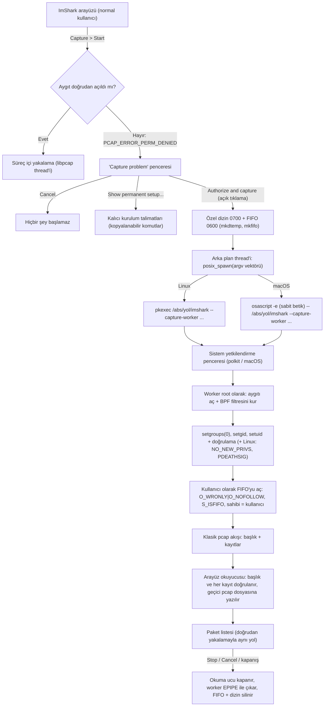

# Canlı Yakalama Yetkileri ve Yetkili Capture Worker

Ağ arabiriminden paket yakalamak (packet sniffing) her işletim sisteminde ayrıcalıklı bir işlemdir. ImShark arayüzü (OpenGL, Dear ImGui, onlarca protokol çözücü ve dosya ayrıştırıcı) **hiçbir zaman** yönetici yetkisiyle çalışmaz. Aygıt doğrudan açılamazsa ve kullanıcı açıkça onaylarsa, ImShark aynı çalıştırılabilir dosyayı `--capture-worker` kipinde, yalnızca aygıtı açmak için yetkili olan küçük bir yardımcı süreç olarak başlatır. Yardımcı aygıtı açar, **yetkilerini geri alınamaz biçimde bırakır** ve paketleri kullanıcının sahip olduğu özel bir FIFO üzerinden arayüze akıtır.

Bu belge kodun yaptığını olduğu gibi anlatır. Sistem genelinde hiçbir izin, capability veya grup değişikliği yapılmaz.

## Akış



Doğrudan yol her zaman önce denenir. Yetkilendirme istemi yalnızca **Authorize and capture** düğmesine tıklanınca başlar; ImShark kendiliğinden hiçbir istem açmaz.

## Neden yetki gerekir

| Platform | Mekanizma | Varsayılan durum |
|---|---|---|
| macOS | `/dev/bpf*` (Berkeley Packet Filter) | `root:wheel`, mod `0600`; normal kullanıcı için `EACCES` |
| Linux | `AF_PACKET` ham soketi | `CAP_NET_RAW` (promiscuous için çoğunlukla `CAP_NET_ADMIN`) gerekir; yoksa `EPERM` |
| Windows | Npcap sürücüsü (`\\.\NPF_*`) | "Restrict Npcap driver's access to Administrators only" seçiliyse yalnızca Administrators ve `npcap-users` açabilir |

## Worker komut satırı

```
imshark --capture-worker --interface <ad> --snaplen <64..262144> --promisc <0|1> \
        --filter <bpf, boş olabilir> --uid <n> --gid <n> --fifo <mutlak yol>
```

* Yedi bayrağın **hepsi** gerekir, her biri **tam bir kez** verilir; her bayrağı bir değer izler (`--bayrak=değer` biçimi yoktur). Bilinmeyen/yinelenen/eksik bayrak, eksik değer, sayısal olmayan veya aralık dışı sayı (snaplen 64..262144), `uid`/`gid` = 0, göreli FIFO yolu, boş veya 255 karakterden uzun arabirim adı reddedilir.
* Değerler **olduğu gibi** alınır: tırnak, boşluk, `$()`, ters tırnak, satır sonu hiçbir zaman yorumlanmaz. Worker'ın hiçbir yerinde shell yoktur.
* Ortam değişkenlerine güvenilmez: worker başlar başlamaz ortamı boşaltır. `umask 077` ve `RLIMIT_CORE=0` ayarlanır.
* Arabirim adı `pcap_findalldevs` listesinde yoksa çıkar.
* Çıkış kodları (stderr'e tek satır mesaj yazılır, arayüz bunu hata metni olarak gösterir):

| Kod | Anlam |
|---|---|
| 0 | Normal bitiş (arayüz kapandı, SIGTERM/SIGINT, kaynak bitti) |
| 2 | Geçersiz argüman |
| 3 | Arabirim yok |
| 4 | Aygıt açılamadı |
| 5 | Aygıt açılamadı: yetki yok (worker yetkisiz başlatıldı) |
| 6 | Geçersiz BPF filtresi |
| 7 | Yetkiler bırakılamadı / hedef uid-gid kabul edilemez |
| 8 | FIFO eksik, FIFO değil veya sahibi yanlış |
| 9 | Yakalama sırasında hata (aygıt kayboldu vb.) |
| 10 | Bu derlemede canlı yakalama / worker yok |

Worker root olarak çalışmıyorsa bırakacak yetki yoktur; bu durumda `--uid/--gid` mevcut kullanıcınınkiyle aynı olmalıdır, aksi halde 7 ile çıkar. (Elle çalıştırıp hata yollarını denemek için kullanışlıdır.)

## Yetkinin bırakılması

Sıra önemlidir ve kod bu sırayı izler (`core/src/capture/capture_worker.cpp`):

1. Argümanlar ayrıştırılır, sinyaller kurulur (SIGPIPE yok sayılır; SIGTERM/SIGINT/SIGHUP bayrak kaldırır, `SA_RESTART` yok), ortam boşaltılır.
2. `pcap_create` / `set_snaplen` / `set_promisc` / `set_timeout(250 ms)` / `pcap_activate` ve `pcap_compile` + `pcap_setfilter`: **yetki gerektiren tek adım budur.**
3. Root ise: `setgroups(0, nullptr)`, `setgid(gid)`, `setuid(uid)`. Ardından doğrulama: `getuid/geteuid == uid`, `getgid/getegid == gid`, `setuid(0)`, `seteuid(0)`, `setgid(0)`, `setegid(0)` **başarısız olmalı**, ek grup kalmamalı. Biri tutmazsa worker 7 koduyla çıkar. `uid 0` / `gid 0` hedefleri reddedilir. Yalnızca birincil grup korunur; ek gruplar bırakılır.
4. Linux: `prctl(PR_SET_NO_NEW_PRIVS, 1)` ve `prctl(PR_SET_PDEATHSIG, SIGTERM)`; ardından `getppid()` yeniden denetlenir (ebeveyn tam bu sırada öldüyse yarış kapanır). Arayüz çökerse çekirdek worker'a SIGTERM gönderir.
5. **Yalnızca bundan sonra** FIFO açılır (artık kullanıcı kimliğiyle): `O_WRONLY | O_NONBLOCK | O_NOFOLLOW | O_CLOEXEC` (okuyucu yoksa `ENXIO` ile en çok 10 sn yeniden denenir, asılmaz), sonra `fstat`: `S_ISFIFO` olmalı ve sahibi `--uid` olmalı, değilse çıkar. Açıldıktan sonra engelleyen (blocking) kipe döner. **Root hiçbir dosyaya yazmaz.**
6. Klasik pcap akışı yazılır: küçük-endian `0xa1b2c3d4` başlığı, gerçek link tipi (DLT_RAW/DLT_LOOP → LINKTYPE dönüşümüyle) ve snaplen; ardından her paket için kayıt (yakalanan uzunluk asla snaplen'i aşmaz).
7. Okuyucunun kapandığı şu yollardan biriyle anlaşılır ve worker temiz çıkar (kod 0): yazma `EPIPE` verir; her pcap zaman aşımında (250 ms) `poll` `POLLERR/POLLHUP` bildirir; FIFO silinmiştir (`fstat` `st_nlink == 0`; macOS boştaki FIFO'nun okuyucusunun gittiğini `poll` ile bildirmez, arayüz bu yüzden bitirirken FIFO'yu siler). SIGTERM/SIGINT de temiz çıkış sağlar.

## Başlatma (arayüz tarafı)

* **Özel dizin ve FIFO:** `mkdtemp` ile `imshark-capture-XXXXXX` (mod `0700`, sahibi kullanıcı; kod `lstat` ile doğrular), içinde `mkfifo("capture.fifo", 0600)`. FIFO'nun okuma ucu önce engellemesiz açılır (`O_RDONLY|O_NONBLOCK`), böylece worker'ın açışı beklemez.
* **Süreç:** argüman **vektörü** `posix_spawn` ile, arka plan thread'inde başlatılır; arayüz hiç bloklanmaz ve "Waiting for administrator authorization..." penceresi **Cancel** düğmesiyle gösterilir. Hiçbir yerde `std::system`, `popen` veya değer birleştirilmiş bir shell satırı yoktur. Çocuğun stdin/stdout'u `/dev/null`, stderr'i bir boru; macOS'ta `POSIX_SPAWN_CLOEXEC_DEFAULT` ile başka hiçbir tanıtıcı çocuğa geçmez. Yürütülebilir dosya yolu `/proc/self/exe` (Linux) veya `_NSGetExecutablePath` + `realpath` (macOS) ile çözülür; `pkexec` ve `osascript` mutlak yollarıyla (`/usr/bin/...`) çağrılır, `PATH` aranmaz.
* **Linux:** `/usr/bin/pkexec <mutlak-yol>/imshark --capture-worker ...` (pkexec programı doğrudan `exec` eder; arada shell yoktur). pkexec yoksa ("pkexec could not be started"), polkit kimlik doğrulama ajanı yoksa veya pencere kapatılırsa (çıkış kodu 127 / 126) açık bir mesaj gösterilir.
* **macOS:** `/usr/bin/osascript -e <satır> -e <satır> ... -- <yol>/imshark --capture-worker ...`. Betik sabit bir şablondur (`osascriptScript()`), hiçbir kullanıcı değeri içermez:

  ```applescript
  on run argv
  set cmd to quoted form of (item 1 of argv)
  repeat with i from 2 to (count of argv)
  set cmd to cmd & " " & (quoted form of (item i of argv))
  end repeat
  do shell script cmd with administrator privileges
  end run
  ```

  Çalıştırılabilir dosya ve her worker argümanı `--` sonrasında ayrı osascript argümanıdır; kabuk tırnaklamasını tamamen AppleScript'in `quoted form of` ifadesi yapar. Kullanıcı yetkilendirme penceresini iptal ederse osascript `-128` hatasıyla çıkar ve "Authorization cancelled" gösterilir. (Boşluk, tek/çift tırnak, `$()`, ters tırnak, `;` ve satır sonu içeren değerlerle elle doğrulandı; hiçbiri yorumlanmadı.)
* **Windows ve diğerleri:** yetki yükseltme yoktur; yalnızca rehber (kalıcı kurulum) gösterilir. Varsayılan Windows derlemesinde zaten canlı yakalama yoktur.

## Okuma tarafı ve doğrulama

`LiveCapture::startFromWorkerStream` FIFO'yu engellemesiz okur. Yazıcı henüz bağlanmamışken `read` 0 döndürür; bu bir EOF sayılmaz, istek iptal edilene, süreç bitene veya 5 dakikalık bağlanma süresi dolana kadar beklenir (worker hiç başlamazsa arayüz asılmaz). Akış `PcapStreamParser` ile **artımlı** ve **sıkı** doğrulanır (`core/src/capture/pcap_stream.cpp`):

* sihirli sayı: dört biçim (little/big endian × mikro/nano saniye); aksi halde ret;
* sürüm ana numarası 2; snaplen 1..262144; link tipi ≤ 65535;
* her kayıtta `incl_len <= snaplen` ve `<= 262144`, zaman damgası kesri aralık içinde; aşırı uzunluk için bellek ayrılmaz;
* başlık veya kayıt ortasında EOF hata sayılır, kayıt sınırında EOF temiz bitiştir; hatadan önceki paketler korunur.

Doğrulanan kayıtlar, kütüphane thread'inin kullandığı **aynı** yoldan (`writeRecord`/`publish`) geçici pcap dosyasına yazılır, dolayısıyla paket listesi, dışa aktarma ve ayrıntılar doğrudan yakalamayla aynıdır. Worker `pcap_stats` iletmediğinden bu oturumda "dropped" sayacı 0 görünür. Worker'ın stderr'i bir boruyla toplanır; çıkış kodu ve metin (`pkexec` 126/127, `osascript` -128, worker'ın kendi satırı) arayüzdeki hata metnini oluşturur.

## Ömür ve temizlik

* **Stop, Cancel veya oturum sonu:** okuma ucu kapatılır (worker `EPIPE`/`POLLHUP` ile çıkar), yardımcı süreç sonlandırılması istenir (`SIGTERM`; 1,5 sn sonra hâlâ yaşıyorsa `SIGKILL`; süreç arka plan thread'inde `waitpid` ile toplanır, arayüz beklemez), FIFO ve dizin silinir. Aynısı hata durumunda (yetkilendirme reddi, bozuk akış, spawn hatası) ve `LiveCapture` yıkıcısında da olur.
* Sinyaller: Linux'ta pkexec yetkilendirme sürerken kullanıcının gerçek kimliğiyle çalıştığı, worker da yetkisini bıraktıktan sonra kullanıcıya ait olduğu için arayüz bunlara `SIGTERM` gönderebilir. Yetkili (root) aşamadaki bir worker sinyal almayabilir; ona FIFO'nun kapanması yeter. macOS'ta `osascript` kullanıcıya aittir ve sonlandırılır; root olarak çalışan worker ise FIFO kapandığı için kendiliğinden çıkar.
* Geçici pcap dosyası ayrıca ilk yakalamadaki gibi arayüzün sahipliğindedir ve oturumu dışa aktarmadığınızda sorulur ("Unsaved capture").

## Yapılmayanlar

ImShark şunları **yapmaz**: `chmod`/`chown` ile aygıt izinlerini değiştirmez (`/dev/bpf*` dahil); `setcap` çalıştırmaz veya dosya capability'si vermez/silmez; kullanıcıyı hiçbir gruba eklemez veya gruptan çıkarmaz; kalıcı kural, LaunchDaemon veya polkit kuralı kurmaz; `std::system`/`popen`/shell kullanmaz; root olarak dosya yazmaz; ortam değişkenlerine güvenmez. Eski ve kaldırılmış tasarımın yaptığı bu hatalar bilerek terk edilmiştir.

## Sınırlamalar

* **AppImage:** `pkexec`, yürütülebilir dosyanın yolunun mutlak ve kalıcı olmasını bekler. AppImage `/tmp/.mount_*` altına bağlanır ve root'a (FUSE'un `allow_other` olmaması nedeniyle) görünmeyebilir; bu durumda "Authorize and capture" başarısız olur. Yolu aynen çalıştırırız; AppImage dosyasını sistem yoluna çıkarın (`--appimage-extract`) veya aşağıdaki kalıcı yöntemlerden birini kullanın.
* **Polkit ajanı yok** (başsız oturum, bazı hafif pencere yöneticileri): pkexec 127 ile döner; mesaj bunu söyler.
* **Güven:** yetkilendirilen dosya, çalışan ImShark yürütülebilir dosyasının kendisidir. Kullanıcının yazabildiği bir dizindeki (ör. `~/build`) ikili için bu, o dosyayı değiştirebilen herhangi bir kullanıcı süreciyle sınırlı bir güven demektir; üretimde ikiliyi root sahipli bir dizine (`/usr/bin`, `/Applications`) kurun.
* Worker yalnızca birincil `gid`'i korur; kullanıcının ek grup üyelikleri bırakılır. Bu yakalama için gerekmez; FIFO zaten kullanıcının kendi dizinindedir.
* macOS'ta çökmüş bir arayüzün ardından boştaki bir worker bir sonraki pakete kadar yaşayabilir (FIFO okuyucusu `poll` ile görünmez; ilk yazma `EPIPE` verir). Linux'ta çekirdek `PDEATHSIG` ile sonlandırır.
* Windows: yetki yükseltme ve worker desteklenmez.
* Gerçek yetkili yakalama bir insan onayı gerektirdiği için bu depodaki otomatik testler gerçek `pkexec`/`osascript` çağırmaz; sahte süreç başlatıcıyla (borular ve `/bin/sh`) tüm akış sınanır.

## Kalıcı alternatifler (kendi sorumluluğunuzda)

Her yakalamada yetkilendirme istemek istemeyenler için. Bunlar sistemi **değiştirir**; ImShark bunları çalıştırmaz, **Show permanent setup...** penceresi yalnızca kopyalanabilir komutlar gösterir.

### macOS: `access_bpf` grubu (Wireshark ChmodBPF)

`chmod 666 /dev/bpf*` kullanmayın: makinedeki her süreç ve kullanıcı tüm trafiği dinleyebilir. Bunun yerine, `/dev/bpf*` aygıtlarını yalnızca `access_bpf` grubuna açan ve her açılışta uygulayan Wireshark'ın ChmodBPF hizmetini kurun:

```bash
brew install --cask wireshark-chmodbpf
sudo dseditgroup -o edit -a "$USER" -t user access_bpf
```

Ardından oturumu kapatıp açın.

### Linux: ayrı grup + capability

```bash
sudo groupadd -r imshark-capture
sudo usermod -aG imshark-capture "$USER"
sudo chgrp imshark-capture /usr/local/bin/imshark
sudo chmod 750 /usr/local/bin/imshark
sudo setcap cap_net_raw,cap_net_admin=eip /usr/local/bin/imshark
```

Yalnızca grup üyeleri ikiliyi çalıştırabilir. Her güncellemeden sonra `setcap` yinelenmelidir (dosya değişince capability silinir). Alternatif: dağıtımınızın `dumpcap` + `wireshark` grubu düzenini kullanın. AppImage için çalışmaz.

### Windows: Npcap

[Npcap](https://npcap.com) kurun. Sürücü yalnızca Administrators'a kısıtlıysa kullanıcıyı `npcap-users` grubuna ekleyin (yönetici komut isteminde) ve oturumu kapatıp açın; ya da ImShark'ı yönetici olarak başlatın:

```cmd
net localgroup npcap-users "%USERNAME%" /add
```
