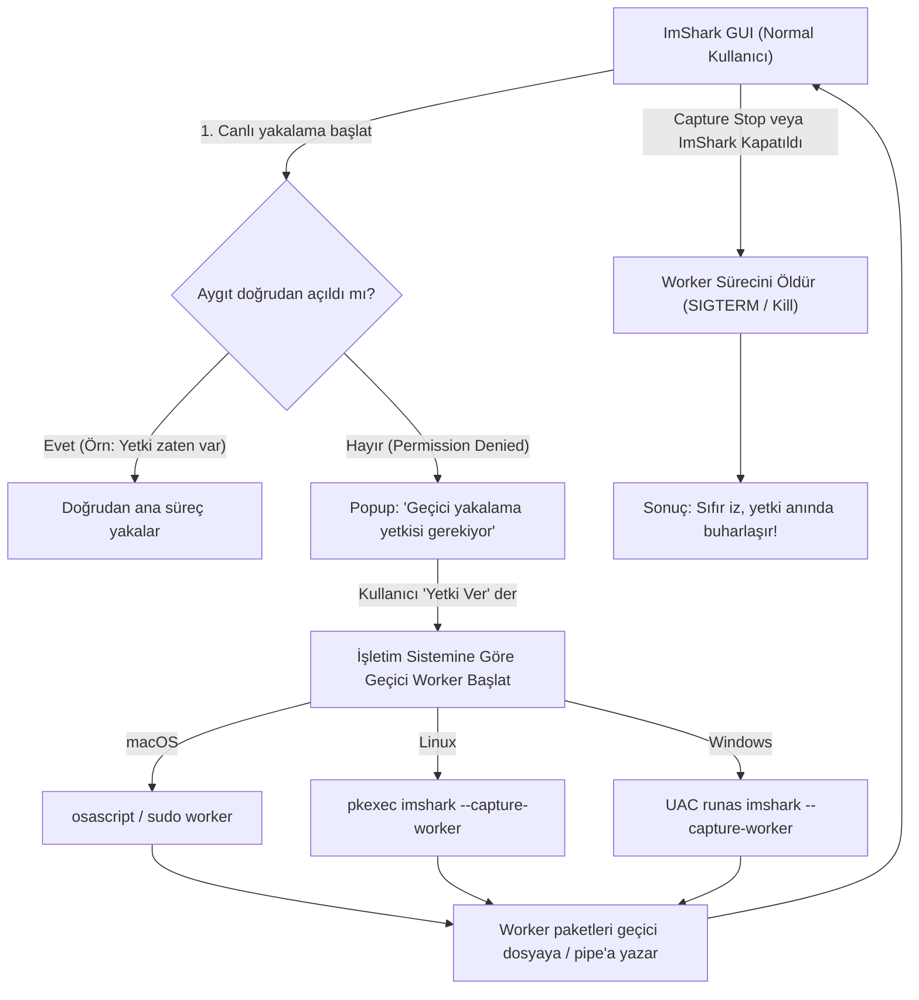

# Capture Yetkileri ve Geçici Ayrıcalık Mimarisi (Capture Privileges and Ephemeral Elevation)

ImShark, ağ paketlerini doğrudan ağ arabiriminden (canlı yakalama / live capture) yakalayabilmek için düşük seviyeli işletim sistemi ve çekirdek (kernel) bileşenlerine erişir. Ağ trafiğini koklamak (packet sniffing), kullanıcı gizliliği ve sistem güvenliği nedeniyle tüm modern işletim sistemlerinde kısıtlanmış ve ayrıcalıklı (privileged) bir işlemdir.

ImShark, **"Sıfır İz" (Zero-Footprint)** güvenlik prensibini benimser. Bu belge; platform bazlı yakalama gereksinimlerini, ImShark'ın geçici (ephemeral) capture worker mimarisini ve alternatif manuel yapılandırma yöntemlerini açıklamaktadır.

---

## Genel Bakış ve Akış Şeması (Overview & Workflow)

ImShark ana arayüzü her zaman kısıtlamasız, standart bir kullanıcı süreci (unprivileged process) olarak çalışır. Canlı yakalama başlatıldığında ağ aygıtına doğrudan erişim sağlanamazsa sistem, kullanıcı onayına dayalı geçici bir yardımcı süreç (**Capture Worker**) devreye sokar:



---

## Neden Yetki Gerekiyor? (Why Privileges Are Needed)

Ham ağ paketlerini işletim sistemi filtrelerinden geçmeden yakalamak, donanım sürücüsü veya çekirdek düzeyinde arayüzler gerektirir. Her işletim sisteminin güvenlik modeli farklıdır:

### 1. macOS: Berkeley Packet Filter (`/dev/bpf*`)
* macOS, paket yakalama için BSD tabanlı **Berkeley Packet Filter** aygıt düğümlerini (`/dev/bpf0`, `/dev/bpf1`, ...) kullanır.
* Varsayılan olarak bu aygıtların dosya izinleri `0600` ve sahipliği `root:wheel` şeklindedir (yalnızca root okuyabilir ve yazabilir).
* Standart bir kullanıcı hesabı altında çalışan süreçler `/dev/bpf*` aygıtını açmaya çalıştığında `pcap_open_live` veya `open()` çağrısı `Permission denied` (EACCES) hatası döndürür.

### 2. Linux: Raw Sockets (`AF_PACKET`, `CAP_NET_RAW` / `CAP_NET_ADMIN`)
* Linux üzerinde libpcap, paketleri dinlemek için `AF_PACKET` soket ailesini (`socket(AF_PACKET, SOCK_RAW, ...)`) kullanır.
* Standart POSIX izinlerine göre ham soket açabilmek için sürecin `CAP_NET_RAW` capability'sine (ayrıca promiscuous mod için çoğunlukla `CAP_NET_ADMIN`) sahip olması gerekir.
* Normal (unprivileged) kullanıcılar bu yetkilere sahip olmadığından `Operation not permitted` (EPERM) hatası oluşur.

### 3. Windows: NDIS 6 Kernel Filter Driver (Npcap)
* Windows üzerinde paket yakalama, Npcap (veya eski WinPcap) çekirdek filtre sürücüsü (`\\.\NPF_*`) aracılığıyla sağlanır.
* Npcap kurulumunda önerilen güvenlik seçeneği olan *"Restrict Npcap driver's access to Administrators only"* etkinleştirildiğinde, sürücü nesnesi yalnızca Administrators ve `npcap-users` yerel grubu tarafından açılabilir.
* Yükseltilmemiş (non-elevated) standart kullanıcı token'ı ile çalışan uygulamalar sürücü tutamacını (handle) açamaz.

---

## Yöntem A: Geçici "Capture Worker" Mimarisi (Method A: Ephemeral Capture Worker Architecture)

### Sıfır İz (Zero-Footprint) Prensibi
Birçok ağ analiz aracı, kullanıcıları sistem genelinde kalıcı güvenlik tavizleri vermeye (örneğin tüm `/dev/bpf*` düğümlerini dünya çapında yazılabilir yapmak veya binary'e kalıcı `setcap` vermek) yönlendirir.

ImShark bu güvenlik açığını önlemek için **geçici worker** modelini benimser:
1. **Ana GUI Süreci Asla Root Çalışmaz:** Grafik motoru (OpenGL), kullanıcı arayüzü (Dear ImGui), karmaşık protokol dissector'ları ve dosya ayrıştırıcıları barındıran devasa bir masaüstü uygulamasını root/yönetici yetkileriyle çalıştırmak ciddi bir güvenlik riski oluşturur. ImShark GUI'si her zaman standart kullanıcı olarak çalışır.
2. **Yalnızca Gerektiğinde ve Anlık Yetki:** Ayrıcalık yükseltme (elevation) yalnızca canlı yakalama başlatıldığında ve yalnızca doğrudan aygıt erişimi yoksa talep edilir.
3. **İzole Süreç:** Yetki, yalnızca paketleri yakalayıp pipe/dosyaya aktaran hafif, başsız (headless) `imshark --capture-worker` sürecine verilir.
4. **Anında Buharlaşma:** Yakalama durdurulduğu anda worker öldürülür ve yetki anında son bulur. Sistemde kalıcı hiçbir dosya, grup veya kural değişikliği bırakılmaz.

### Neden Kalıcı Yetkiler Yerine Oturumluk Worker?

| Yaklaşım | Avantaj | Dezavantaj / Güvenlik Riski |
|---|---|---|
| **Kalıcı `chmod 666 /dev/bpf*` (macOS)** | Bir kez yapılır, tekrar şifre sormaz | Makinedeki herhangi bir zararlı yazılım veya yetkisiz kullanıcı tüm ağ trafiğini gizlice dinleyebilir. |
| **Kalıcı `setcap` (Linux)** | Tekrar şifre sormaz | Binary güncellendiğinde kaybolur; binary dosya bütünlük kontrolü bozulabilir; binary üzerindeki güvenlik açıklarında saldırı yüzeyi büyür. |
| **Kalıcı Grup Üyeliği (`wireshark` / `npcap-users`)** | Standarda yakın | Kullanıcı oturumundaki her uygulama kalıcı olarak paket yakalama yetkisi kazanır. |
| **ImShark Geçici Worker (Önerilen)** | **Sıfır iz, tam güvenlik, kalıcı ayar gerektirmez, GUI daima unprivileged kalır** | İlk yakalama başlangıcında tek seferlik OS yetkilendirme penceresi (UAC/Touch ID/Polkit) açılır. |

### Platform Bazında Yürütülen İşlemler

#### macOS: `osascript` Elevation & Watchdog
* ImShark GUI, `osascript` aracılığıyla yerel macOS yetkilendirme penceresini tetikler:
  ```bash
  osascript -e 'do shell script "\"/path/to/imshark\" --capture-worker --interface en0 --output-pipe /tmp/imshark.fifo" with administrator privileges'
  ```
* Kullanıcı Touch ID veya yönetici parolasıyla onay verir.
* Başlatılan worker, ana sürecin PID'sini izleyen bir watchdog mekanizmasına sahiptir. Ana GUI kapandığında worker otomatik olarak sonlanır.

#### Linux: PolicyKit (`pkexec`)
* Linux üzerinde masaüstü standartlarına uygun olarak `pkexec` (PolicyKit) kullanılır:
  ```bash
  pkexec /path/to/imshark --capture-worker --interface eth0 --output-pipe /tmp/imshark.fifo
  ```
* Sistem yerel polkit kimlik doğrulama penceresini (GNOME/KDE/vb.) açar.
* Worker süreci `prctl(PR_SET_PDEATHSIG, SIGTERM)` çağrısı yaparak ana sürecin beklenmedik şekilde kapanması durumunda çekirdek tarafından anında sonlandırılmasını garanti eder.

#### Windows: `ShellExecuteEx("runas")` & Job Object
* Windows üzerinde `ShellExecuteEx` API'si `"runas"` fiili (verb) ile çağrılarak standart UAC (User Account Control) penceresi tetiklenir:
  ```cmd
  imshark.exe --capture-worker --interface \Device\NPF_{...} --output-pipe \\.\pipe\imshark-capture-xxx
  ```
* İletişim Windows Named Pipe üzerinden sağlanır.
* Worker süreci `JOB_OBJECT_LIMIT_KILL_ON_JOB_CLOSE` bayrağı atanmış bir Windows Job Object'e dahil edilir. GUI kapandığında veya çöktüğünde işletim sistemi worker sürecini otomatik olarak sonlandırır.

---

## Temizleme ve Kapanış (Cleanup on Exit)

Yakalama sonlandırıldığında veya ImShark kapatıldığında aşağıdaki adımlar işletilir:

1. **Süreç Sonlandırma:**
   - GUI iş parçacığı worker sürecine durdurma sinyali gönderir (Unix: `SIGTERM`, Windows: IPC sinyali / `TerminateProcess`).
   - Süreç belirli bir zaman aşımı (500 ms) içerisinde kapanmazsa zorla sonlandırılır (`SIGKILL`).
2. **Geçici Kaynakların Kaldırılması:**
   - Yakalama süresince kullanılan geçici FIFO boruları, named pipe'lar ve geçici pcap dosyaları `unlink` / `DeleteFile` ile tamamen temizlenir.
3. **Kalıntısız Durum:**
   - Sistem dosya izinlerinde, kullanıcı gruplarında veya yetki listelerinde hiçbir kalıcı iz bırakılmaz.
   - Yakalama oturumu kapandığı anda tüm ek ayrıcalıklar anında buharlaşır.

---

## Alternatif Manuel Çözümler (Alternative Manual Solutions)

Her yakalamada yetki istemiyle karşılaşmak istemeyen ve kalıcı sistem yetkilendirmesini bilinçli olarak tercih eden kullanıcılar için alternatif yöntemler:

### macOS
1. **Geçici Oturum İzni:**
   Terminal üzerinden `/dev/bpf*` aygıtlarına okuma/yazma izni verilebilir (yeniden başlatmada sıfırlanır):
   ```bash
   sudo chmod 666 /dev/bpf*
   ```
2. **Kalıcı ChmodBPF LaunchDaemon (Wireshark yöntemi):**
   Sistem açılışında `access_bpf` grubuna izin veren ChmodBPF servisi kurulabilir:
   ```bash
   brew install --cask wireshark-chmodbpf
   ```

### Linux
1. **İkili Dosyaya Linux Capabilities Tanımlama:**
   ImShark binary dosyasına doğrudan ağ yakalama yetkisi verilebilir:
   ```bash
   sudo setcap cap_net_raw,cap_net_admin=eip /usr/local/bin/imshark
   ```
2. **Kullanıcıyı Yakalama Grubuna Ekleme:**
   `pcap` veya `wireshark` grubu üzerinden erişim için:
   ```bash
   sudo groupadd -r pcap
   sudo usermod -a -G pcap $USER
   sudo setrlimits /usr/local/bin/dumpcap ... # veya grup tabanlı ayarlar
   ```

### Windows
1. **`npcap-users` Grubuna Kullanıcı Ekleme:**
   Yönetici haklarıyla açılmış Komut İstemi'nde (CMD):
   ```cmd
   net localgroup npcap-users "%USERNAME%" /add
   ```
   *Not: Değişikliğin geçerli olması için oturumu kapatıp yeniden açmanız gerekir.*
